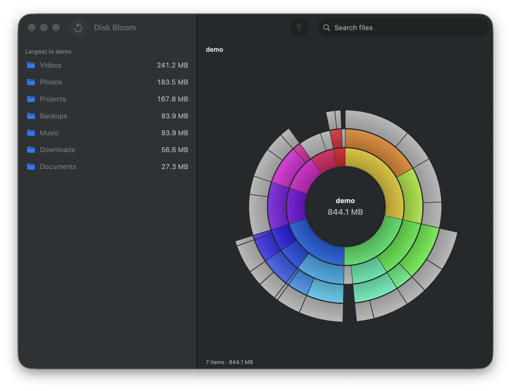

<div align="center">

# Disk Bloom

[](LICENSE)
[](https://jeangalea.com)

**A free, native macOS disk space visualizer — see where your space went, then clean it up safely.**

</div>



Disk Bloom is a free alternative to DaisyDisk, GrandPerspective, Disk Inventory X and OmniDiskSweeper, and to cross-platform tools like SquirrelDisk, WinDirStat and WizTree.

Pick a volume or folder, get a fast concurrent scan, then explore an interactive sunburst: hover for size and percentage, click a segment to zoom in (with animated transitions), click the center to go back up, press space to Quick Look a file, and right-click to reveal in Finder, collect for batch deletion, or move to Trash. It never hard-deletes anything.

## Features

- Sunburst chart with animated zoom, hover details and breadcrumbs
- Scanner counts what's actually on disk: hardlinked files count once (du semantics), firmlinked directories aren't double-counted, symlinks are never followed, scans stay on one volume — a whole-disk total matches `df`
- Fast: bulk directory enumeration (`getattrlistbulk`) with parallel traversal, faster than `du` on the same tree
- Search the scanned tree, largest results first
- Collector: stage files and folders from anywhere, review the total, move everything to Trash in one step
- Quick Look previews before you delete
- Purgeable space shown per volume
- Multiple windows (⌘N), each with an independent scan
- Administrator scan for folders your user can't read, and guided Full Disk Access setup for protected user data

## Requirements

macOS 14 or later. Building needs Xcode and [xcodegen](https://github.com/yonaskolb/XcodeGen).

## Build

```
xcodegen
xcodebuild -project Bloom.xcodeproj -scheme Bloom -configuration Release build
```

The app lands in `build/` (or your derived data path) as `Disk Bloom.app`. Engine tests: `cd Packages/BloomCore && swift test`.

## Privileged scanning

- "Scan as administrator" runs the embedded `bloom-scan` helper with admin privileges — one password prompt per scan. The helper scans with the same engine and hands the tree back through a serialized temp file.
- For everyday scans, grant the app Full Disk Access (System Settings → Privacy & Security). That's what stops macOS's per-folder permission pop-ups; the welcome screen offers it when not granted.

## Debug flags

Useful for testing and screenshots:

- `--autoscan <dir>` — skip the welcome screen and scan a path
- `--autofocus <child>` / `--autotrash <child>` / `--autocollect <child>` / `--autosearch <query>` — drive the UI
- `--report <path>` — write the scanned tree as text and exit
- `--snapshot <dir> --out <png>` — render a chart offscreen to PNG
- `--icon <png>` — render the app icon artwork
